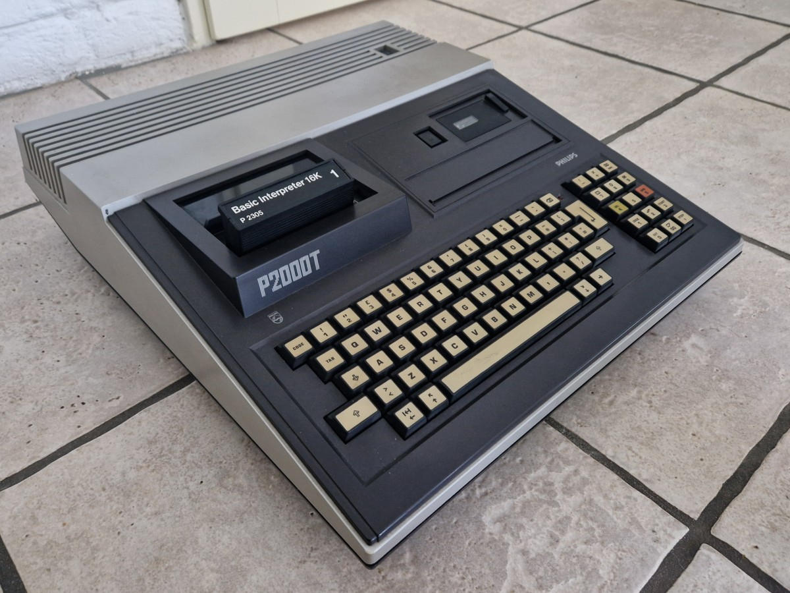
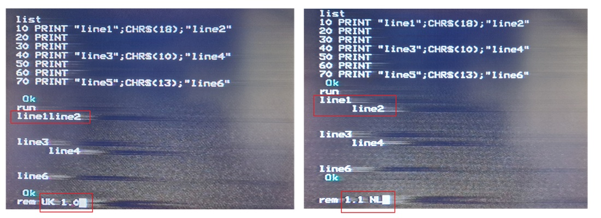
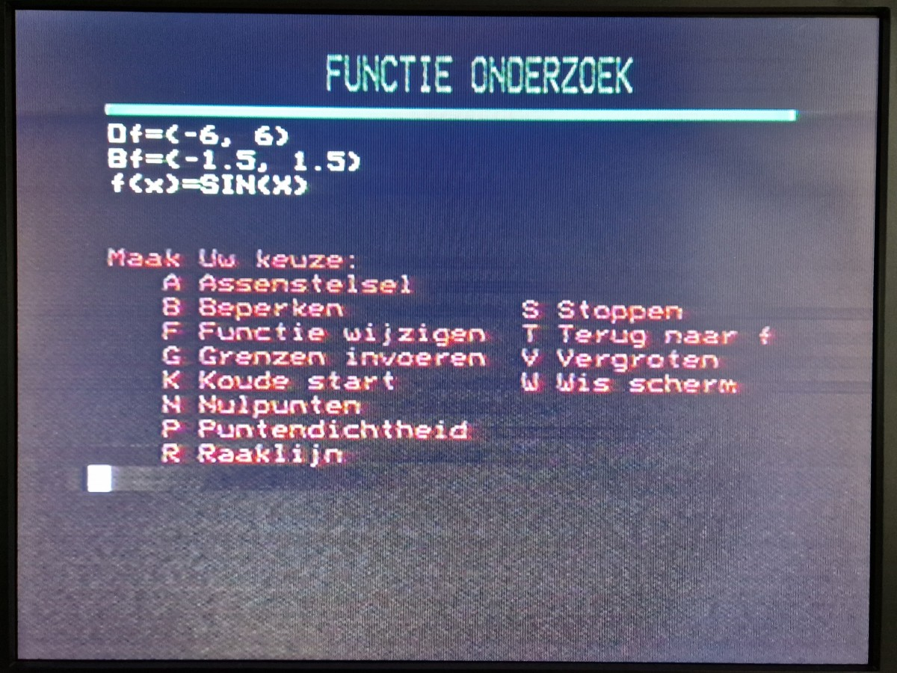
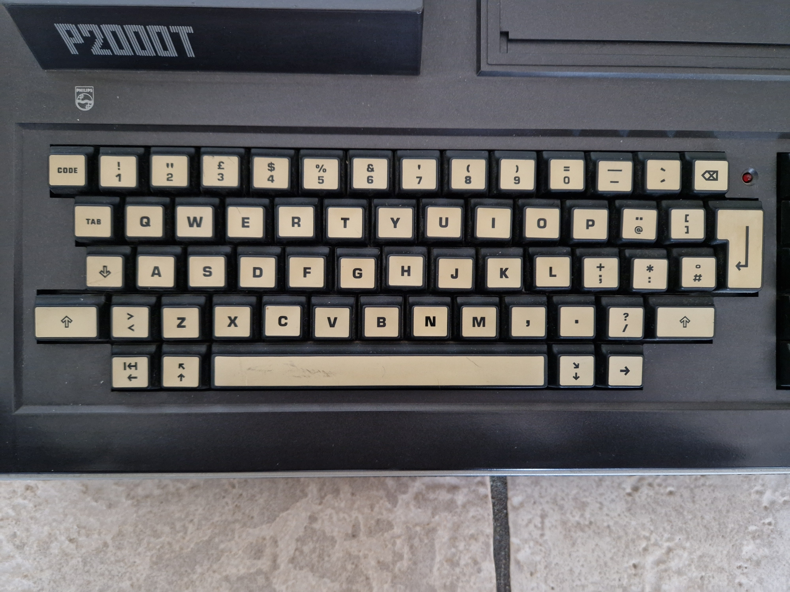
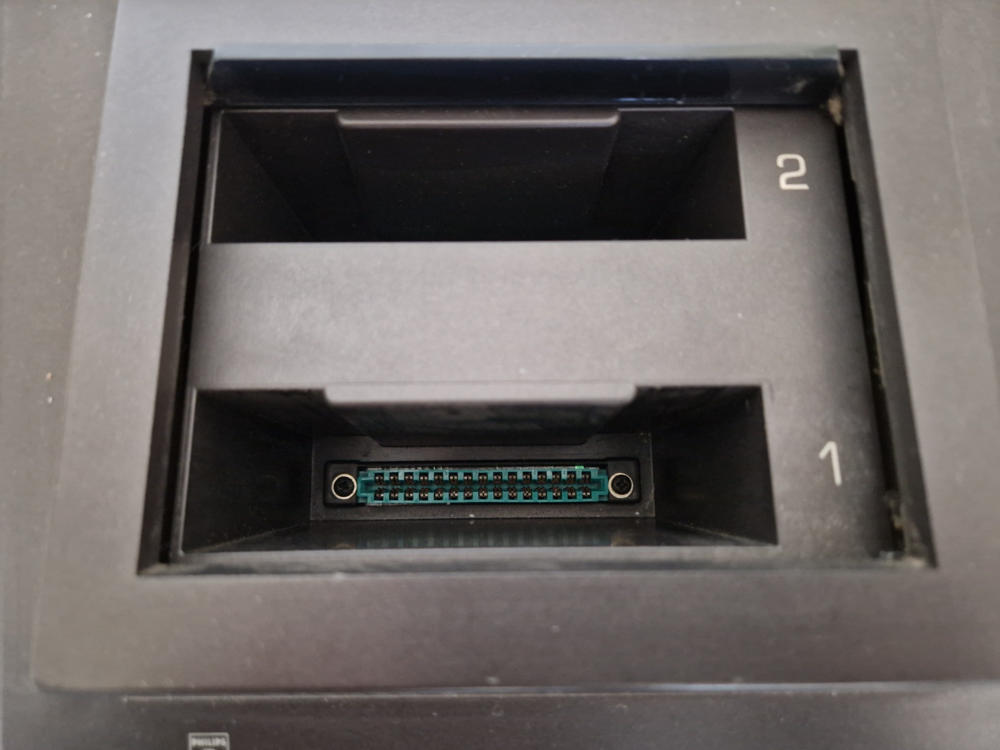
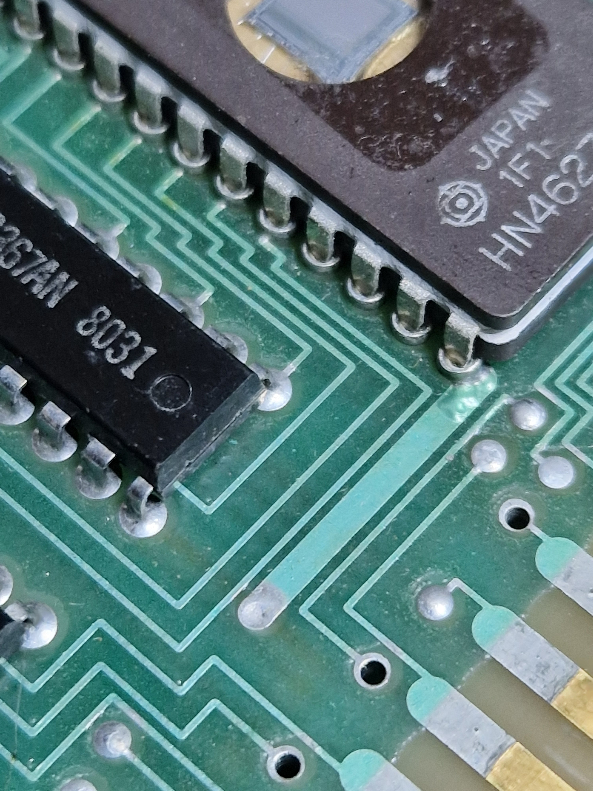
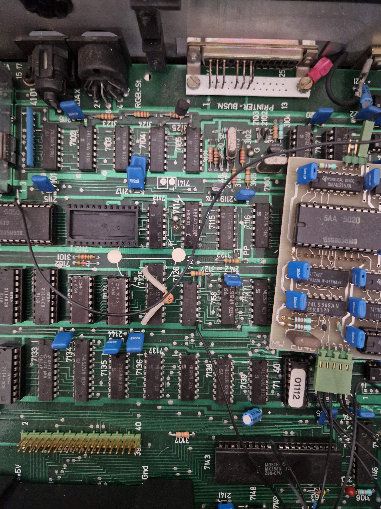
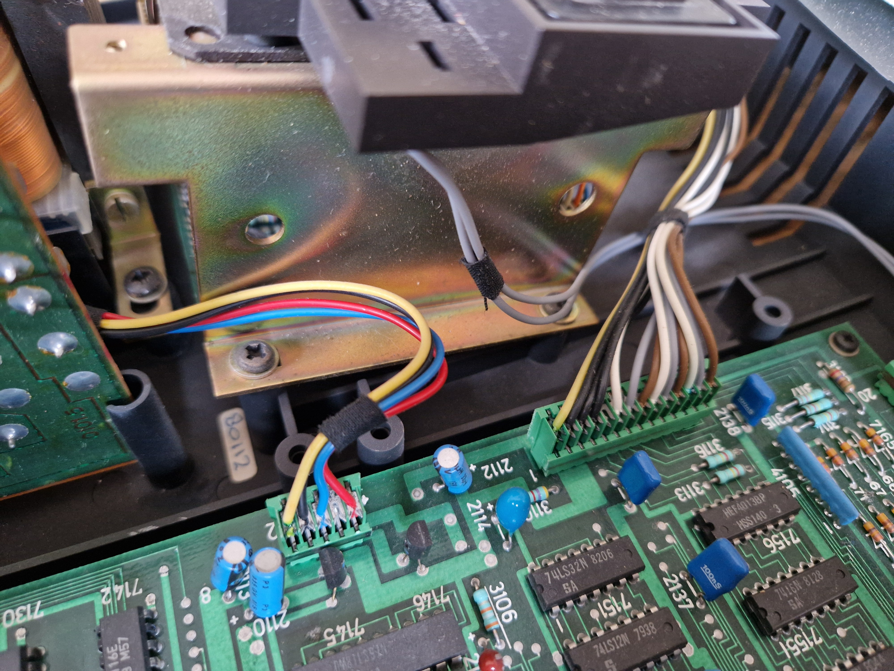

# P2000T

I retrieved a Philips P2000T from my attic, and started to investigate it.
This document describes my findings.

Firstly, getting to understand BASIC, next a quick look at improving my video, 
next, detailing the BASIC cartridge. I also tried to archive a P2000 program 
I wrote 40 years ago.



Scroll down for an extensive [photo gallery](#photo-gallery).


## Contents

- [BASIC](#basic)
  - [Editing](#editing)
  - [Tape](#tape)
  - [Serial Port](#serial-port)
  - [Character modes](#character-modes)
  - [Special characters](#special-characters)
  - [BASIC versions](#basic-versions)
  - [P2000 BASIC features](#p2000-basic-features)

- [Video](#video)
  - [RF link](#rf-link)
  - [Mods](#mods)
  - [DIN-SCART cable](#din-scart-cable)
  - [Result](#result)
  
- [Cartridge](#cartridge)
  - [Memory map](#memory-map)
  - [Cartridge internals](#cartridge-internals)
  - [Cartridge header](#cartridge-header)
  - [Cartridge dump](#cartridge-dump)
  - [Addressing](#addressing)
  
- [Archive GRAFIEK](#archive-grafiek)
  - [Screenshots](#screenshots)
  - [LLIST](#llist)
  - [Dump trial](#dump-trial)
  - [Dump Grafiek](#dump-grafiek)
  - [40 year later analysis](#40-year-later-analysis)
  
- [Photo gallery](#photo-gallery)

- [Todo](#todo)

- [Links](#links)


## BASIC

I started with the cartridge "Basic Interpreter 16K" or "P2305" (for slot "1").
Trying a "10-print" program works as expected. Still I had some issues.


### Editing

To edit a basic program, say line 30, you can not just type `LIST`, 
cursor to line 30 and start correcting (as I do on the C64). You have 
to give the command `EDIT 30`, and then you are in a sort of 
[VI editor](https://en.wikipedia.org/wiki/Vi_(text_editor)) 
(that only helps if you did a bit of Linux).
This editor has three states: command, insert, overwrite.

By default, you are in the _command_ state where pressing a key gives a command:
- `I` ("insert") switches to _insert_ state; each character typed next is 
  inserted before the old text. `CODE` switches back to the _command_ state.
- `C` ("change") switches to _overwrite_ state; each character typed next 
  overwrites the old text. `CODE` switches back to the _command_ state.
- `X` ("append") moves to end of line and switches to the _insert_ state.
- `H` ("del eoln") deletes to end of line and switches to the _insert_ state.
- `S` ("search") moves the cursor to the next character typed. 
  Use Shift `Cursor right` for find next.
- `K` ("kill search") deletes to the next character typed.
- `ENTER` commits changes.
- `N` ("next") commits changes and edits next line.
- `STOP` (Shift `,` on numeric keypad) aborts all changes.
- `Backspace` _backspaces_ one character left of the cursor, and Shift `Backspace` 
  deletes one character under the cursor.
- Tip: also the _line number_ can be edited (then, the old line stays as is).

In all modes, the cursor keys are operational.

Tip: `LIST .` and `EDIT .` list respectively edit the last listed or edited line.
Numeric Shift 0 (`Def`) is a shorthand for `EDIT .`.

Tip: Numeric Shift 9 (`M`) toggles paged listing; when `LIST` has filled one
screen, a `meer` (more) is shown.

This overview is for BASIC 1.1; BASIC 1.0 UK is severely limited: e.g. 
the cursor keys don't work and and `C` is temporary.
The old `EDIT` seems to be more VI like than I thought, see 
[P2000GG](https://github.com/p2000t/documentation/blob/main/P2000gg/p2000ggnieuwsbrief1-7.pdf) page 5.


### Tape

The tape recorder works as a disk drive. It is formatted in blocks of 1k byte.
One side of the tape has 42 blocks.

You can get a directory with Zoek (Shift `1` on numeric keyboard), 
and load and save is with commands `CLOAD` and `CSAVE` to tape blocks.


The directory listing only shows the first character of every file in 
BASIC 1.0 UK, the screenshot is for BASIC 1.1 NL.

The `BAS` indicates the file type (BASIC program). Another example is `SNG`
which indicates an array of singles was saved to the tape. The `B` behind 
the file type indicates this file requires th BASIC cartridge.
Command for savinf singles array `A` is something like `CSAVE* A @ "filename"`.

The key Shift 7 on the numeric keypad `[oo]` formats a tape.


### Serial port

The P2000T has a printer port at the back. 


The great thing is that this is actually a _serial_ port.
To connect it to a PC, you need an old style D25 connector/converter, and 
a cable to convert from serial to USB. I used a 
[US232R-500-BULK](https://nl.mouser.com/ProductDetail/FTDI/US232R-500-BULK).

> Just using RX/TX is not enough, probably RTS needs to be high as well.
> Check details in [natlab nieuwsbrief](https://github.com/p2000t/documentation/blob/main/NatLab/nieuwsbriefnatlab064-095.pdf) nr 76

In the PC start a terminal, e.g. [ninjaterm](https://ninjaterm-app.mbedded.ninja/), 
connect to the correct COM port with settings 1200,8,N,1, and 
try `LPRINT` to print a line, `LLIST` to list the program on the printer,
or use print-screen (Shift `00` on numeric keyboard) to copy the current 
screen to the printer.

Here an example on an empty screen.
I first did a `list`, then a `run` (which prints due to the
`LPRINT` statements), then a `llist` (which prints the listing), and finally 
I pressed print screen.


The print screen button does not seem to work in BASIC 1.0 UK.

> The `LLIST` and print screen are low threshold features to get 
> data from P2000T to PC.


### Character modes

The cartridge has two character _modes_, lets call them mix and all-caps.
This mode is not to be confused with the capslock state. 

In the _mix_ mode, this is the behavior of shift and capslock.

| key  | no shift, no capslock | shift, no capslock | no shift, capslock | shift, capslock |
|:----:|:---------------------:|:------------------:|:------------------:|:---------------:|
| [A]  |        **a**          |         A          |         A          |         A       |
| [1!] |          1            |         !          |         !          |         !       |

In the _all-caps_ mode, this is the behavior of shift and capslock.

| key  | no shift, no capslock | shift, no capslock | no shift, capslock | shift, capslock |
|:----:|:---------------------:|:------------------:|:------------------:|:---------------:|
| [A]  |        **A**          |         A          |         A          |         A       |
| [1!] |          1            |         !          |         !          |         !       |

To engage capslock press the _Capslock_ key, to disengage capslock press the Shift key.
To toggle the character mode press _Shift and Tab_.


BASIC itself is not case sensitive, so `print` and `PRINT` are the same, and so
are `a$` and `A$`. What is more, BASIC converts these to uppercase when you type 
the lowercase (in program text).

However, as I discovered, some programs ask `Are you sure [y/n]?` and 
they do not accept (uppercase) `Y`.

BASIC 1.1 NL starts in mix mode, but the BASIC 1.0 UK starts in all-caps mode.

Later I found out the `POKE &H60B6,0` selects all-caps and `POKE &H60B6,1`
selects mix mode.


### Special characters

P2000 BASIC has several special characters. But there is no comprehensive list.
This is copied from various places in the Dutch 
[Gebruiksaanwijzing](docs/Gebruiksaanwijzing-P2000T-met-P2305-BASIC-NL.pdf).

 |CHRS()| description lower set                                               |
 |-----:|:--------------------------------------------------------------------| 
 |   0  | einde toonstring                                                    |
 |   1  | cursor aan                                                          | 
 |   2  | cursor uit                                                          |
 |   3  | zet linker helft van beeldgeheugen op scherm (OUT 48,0) en CHR$(29) |
 |   4  | positioneer cursor. Te volgen door CHR$(regel)CHR$(kolom)           |
 |   5  | scherm naar printer                                                 |
 |   6  | definieer plaats cursor als nieuw cursor punt                       |
 |   7  | korte piep                                                          |
 |   8  | cursor naar links met overloop op vorige regel                      |
 |   9  | horizontale TAB                                                     |
 |  10  | cursor omlaag of scherm opvoer                                      |
 |  11  | wis karakter links van cursor                                       |
 |  12  | wis venster, zet cursor en cursorpunt links boven in venster        |
 |  13  | cursor naar linker kantlijn venster                                 |
 |  14  | zet deel-PRINT aan                                                  |
 |  15  | wis van plaats cursor tot cursorpunt                                |
 |  16  | cursor 1 stap naar links (tot randen van het venster)               |
 |  17  | cursor 1 stap omhoog (tot randen van het venster)                   |
 |  18  | cursor 1 stap omlaag (tot randen van het venster)                   |
 |  19  | cursor 1 stap naar rechts (tot randen van het venster)              |
 |  20  | zet cursor op kolom k; te volgen door CHR$(k)                       |
 |  21  | wis tot einde schermregel                                           |
 |  22  | wis tot einde venster                                               |
 |  23  | toonstring, CHR$(23)CHR$(T)CHR$(N1)CHR$(N2)...CHR$(0)               |
 |      | T lengte toon (in 4T ms), frequentie 34.7/N kHz                     |
 |  24  | cursor 1 stap naar rechts met overloop                              |
 |  28  | zet venster op 24 regels, 40 kolommen en wis venster                |
 |  29  | als cursor niet links in het venster staat dan CHR$(13) + CHR$(10)  |
 |  30  | zet deel-PRINT uit                                                  |
 |  31  | zet cursor op cursorpunt                                            |

The column "dft" indicates how each line starts.

 |CHRS()|dft| description higher set                                              |
 |-----:|:-:|:--------------------------------------------------------------------| 
 | 128  |   | ? _zwart (voorgrond kleur) in teletext_                             |
 | 129  |   | rood (voorgrond kleur)                                              |
 | 130  |   | groen (voorgrond kleur)                                             |
 | 131  |   | geel (voorgrond kleur)                                              |
 | 132  |   | blauw (voorgrond kleur)                                             |
 | 133  |   | magenta/paars (voorgrond kleur)                                     |
 | 134  |   | cyaan/lichtblauw (voorgrond kleur)                                  |
 | 135  | × | wit (voorgrond kleur)                                               |
 | 136  |   | laat de rest van de regel knipperen                                 |
 | 137  | × | schakelt knipperen weer uit                                         |
 | 138  |   | ? _start box - not used in teletext_                                |
 | 139  |   | ? _end box - not used in teletext_                                  |
 | 140  | × | schakelt op lettertekens van normale hoogte                         |
 | 141  |   | schakelt op lettertekens van dubbele hoogte                         |
 | 142  |   | ? _double width - not used in teletext_                             |
 | 143  |   | ? _double height and width - not used in teletext_                  |
 | 144  |   | ? grafische mode (mosaic) zwart                                     |
 | 145  |   | grafische mode (mosaic) rood                                        |
 | 146  |   | grafische mode (mosaic) groen                                       |
 | 147  |   | grafische mode (mosaic) geel                                        |
 | 148  |   | grafische mode (mosaic) blauw                                       |
 | 149  |   | grafische mode (mosaic) magenta/paars                               |
 | 150  |   | grafische mode (mosaic) cyaan/lichtblauw                            |
 | 151  |   | grafische mode (mosaic) wit                                         |
 | 152  |   | ? _conceal in teletext_                                             |
 | 153  | × | mosaic continuous set                                               |
 | 154  |   | mosaic separated set                                                |
 | 155  |   | ? _control sequence intro - not used in teletext_                   |
 | 156  |   | achtergrond kleur (terug) op zwart                                  |
 | 157  |   | achtergrond kleur wordt huidige voorgrond kleur                     |
 | 158  |   | rest van regel: herhaal grafische char bij kleurwissel (ipv spatie) |
 | 159  | × | zet chr$(158) weer uit                                              |

Two small examples: 


A puzzling example can also be found in 
[Nieuwsbrief natlab](https://github.com/p2000t/documentation/blob/main/NatLab/nieuwsbriefnatlab128-159.pdf) at 127.

```BASIC
100 REM Color demo
110 N=50 : GOSUB 200
120 N=50+128 : GOSUB 200
130 END
200 FOR B=129 TO 135
210 FOR F=129 TO 135
220 PRINT CHR$(B);CHR$(157);CHR$(F);CHR$(N+30);CHR$(N);
230 NEXT F:PRINT:NEXT B:PRINT:RETURN
```


Finally, a demo you need to _hear_:

```BASIC
90 CLEAR 500:REM Frere Jacques
100 DEF FNC$(F)=CHR$(INT(34700/F))
110 DEF FNPLAY$(MS,TUNE$)=CHR$(23)+CHR$(MS/4)+TUNE$+CHR$(0)
120 S1$=FNC$(262)+FNC$(294)+FNC$(323)+FNC$(262)
130 S2$=FNC$(330)+FNC$(349)+FNC$(392)
140 S3$=FNC$(392)+FNC$(440)+FNC$(392)+FNC$(349)+FNC$(330)+FNC$(262)
150 S4$=FNC$(262)+FNC$(196)+FNC$(262)
160 T$=S1$+S1$+S2$+S2$+S3$+S3$+S4$+S4$
170 PRINT FNPLAY$(300,T$)
```

Funny things happen. For example with ASCII code 35. Recall 12 is clear 
screen, ensuring all next prints happen at &H5000.

```BASIC
PRINT CHR$(12);CHR$(34);CHR$(35);CHR$(36);: FOR I=&H500 TO I+2: PRINT PEEK(I); :NEXT 
"#$ 34 95 36
```

Also funny, ASCI code 126.

```BASIC
PRINT CHR$(12);CHR$(125);CHR$(126);CHR$(127);: FOR I=&H500 TO I+2: PRINT PEEK(I); :NEXT 
¾¼■ 125 92 127
```

The Dutch [Gebruiksaanwijzing](docs/Gebruiksaanwijzing-P2000T-met-P2305-BASIC-NL.pdf) 
page 146 claims this has to do with ASCII compatibility. OK ... I guess.

What about this sequence? 

```BASIC
PRINT CHR$(12);CHR$(131);CHR$(65);CHR$(66);CHR$(67);: FOR I=&H500 TO I+3: PRINT PEEK(I); :NEXT 
ABC 3  65  66  67
```

And all text is in yellow, but with code 3, not 131.
I found this [teletext table](https://www.wiels.nl/teletext/).

 | poke| name| long name              | description                                                                              |
 |----:|:---:|:-----------------------|:-----------------------------------------------------------------------------------------|
 |  0  | ABK | ALPHA BLACK            | alphanumeric set (dus niet 1 van de 2 mosaic sets), kleur zwart                          |
 |  1  | ANR | ALPHA RED              | alphanumeric set, kleur rood                                                             |
 |  2  | ANG | ALPHA GREEN            | alphanumeric set, kleur groen                                                            |
 |  3  | ANY | ALPHA YELLOW           | alphanumeric set, kleur geel                                                             |
 |  4  | ANB | ALPHA BLUE             | alphanumeric set, kleur blauw                                                            |
 |  5  | ANM | ALPHA MAGENTA          | alphanumeric set, kleur magenta                                                          |
 |  6  | ANC | ALPHA CYAN             | alphanumeric set, kleur cyaan                                                            |
 |  7  | ANW | ALPHA WHITE            | alphanumeric set, kleur wit                                                              |
 |  8  | FSH | FLASH                  | knipperend                                                                               |
 |  9  | STD | STEADY                 | niet knipperend                                                                          |
 | 10  | SBX | START BOX              | wordt niet gebruikt bij teletekst                                                        |
 | 11  | EBX | END BOX                | wordt niet gebruikt bij teletekst                                                        |
 | 12  | NSZ | NORMAL SIZE            | hoogte van de letter = 1 regel                                                           |
 | 13  | DBH | DOUBLE HEIGHT          | hoogte van de letter = 2 regels (zie opmerkingen)                                        |
 | 14  | DBW | DOUBLE WIDTH           | 2 x normale breedte, wordt niet gebruikt bij teletekst                                   |
 | 15  | DBS | DOUBLE SIZE            | 2 x normale breedte en hoogte, wordt niet gebruikt bij teletekst                         |
 | 16  | MBK | MOSAIC BLACK           | mosaic set (1 van de twee, zie 25 en 26), kleur zwart                                    |
 | 17  | MSR | MOSAIC RED             | mosaic set, kleur rood                                                                   |
 | 18  | MSG | MOSAIC GREEN           | mosaic set, kleur groen                                                                  |
 | 19  | MSY | MOSAIC YELLOW          | mosaic set, kleur geel                                                                   |
 | 20  | MSB | MOSAIC BLUE            | mosaic set, kleur blauw                                                                  |
 | 21  | MSM | MOSAIC MAGENTA         | mosaic set, kleur magenta                                                                |
 | 22  | MSC | MOSAIC CYAN            | mosaic set, kleur cyaan                                                                  |
 | 23  | MSW | MOSAIC WHITE           | mosaic set, kleur wit                                                                    |
 | 24  | CDY | CONCEAL DISPLAY        | verborgen text, opgeheven wanneer andere kleur wordt gekozen                             |
 | 25  | SPL | STOP LINING            | bij mosaic continuous set gebruiken                                                      |
 | 26  | STL | START LINING           | bij mosaic separated set gebruiken                                                       |
 | 27  | CSI | CONTROL SEQUENCE INTRO | wordt niet gebruikt bij teletekst                                                        |
 | 28  | BBD | BLACK BACKGROUND       | achtergrondkleur van de characters zwart                                                 |
 | 29  | NBD | NEW BACKGROUND         | achtergrondkleur wordt de kleur van de characters                                        |
 | 30  | HMS | HOLD MOSAIC            | bij mosaic set de laatst gebruikte character weergeven als er een control character staat|
 | 31  | RMS | RELEASE MOSAIC         | bij mosaic set een spatie weergeven als er een control character staat (default)         |


### BASIC versions  
What really confused me in the beginning was that my P2000T did not do what the 
manual [Gebruiksaanwijzing](docs/Gebruiksaanwijzing-P2000T-met-P2305-BASIC-NL.pdf) specified
(copy of [other repo](https://github.com/p2000t/documentation/blob/main/programming/Gebruiksaanwijzing%20P2000T%20met%20P2305%20Basic%20NL.pdf)).
Later I found out the manual is for version NL 1.1, and my cartridge is UK 1.0.

Differences I found
- Version 1.1 adds many control chars. For example see that control 
  character 18 is not working in 1.0.

  
  
- Several keyboard keys are not working: cursor (!), print screen (numeric Shift 5), 
  clear screen (numeric Shift upper right), Def for edit last (numeric Shift 0).
  
  I did have a "Tekstbewerking" or "P2301" (for slot "1") cartridge, and there 
  the cursor keys did work, so I did know it was not a hardware fault.
  
- Tape directory (Zoek numeric Shift 1) only shows first char of file name, 
  instead of full name, file type and file size.
  
- Statement `inp("")` to get a single keyboard key does not work in 1.0.

- Default character mode is all-caps in 1.0. I did not know I could switch 
  to mixed (see above), but my program required that.


### P2000 BASIC features

How do I grade the P2000 BASIC? My reference is Commodore 64 (C64) BASIC.

- Having to use `EDIT` instead of screen editing is a bummer.

- Good to have support for hex with (`&H9000`) and `HEX$()`. 
  Who needs `OCT$()`, but where is `BIN$()`?

- I'm missing `DEEK()` and `DOKE()` for two-byte addresses.

- Nice there is a way to get the address of a variable with `VARPTR(var)`.

- `DEF FN` is much more useful than in e.g. C64, since the function can have 
  multiple arguments and the return type can be string. See for example 
  `FNPLAY$()` in a previous section.
  
- Unlike C64 BASIC where all computations are done in single precision, 
  P2000 BASIC has several data types: single, double, int, string.

- `CLEAR 50,&H9000` allows reserving some RAM from BASIC to 
  e.g. a machine language routine.

- Support for up to 10 machine language routines, and the ability so set and 
  address for them: `DEF USR5=&H9001`. Calling is via `USR5(23)`.

- Misses file `OPEN` and file `READ#` and `WRITE#`. `CLOAD*` and `CSAVE*` 
  load and save entire arrays. Nicely high level, but maybe too inflexible.

- Triggering an error with `ERROR <num>`, even using fresh numbers is nice.
  Also good to have `ON ERROR GOTO`, `ERL` (line) and `ERR` (error code).
  
- Some string functions are nice, `INSTR(pos,str1,str2)`, some are ok,
  `STRING(num,char)`. For me `SPACE$(num)` is overkill.
  
- Printer support (`LPRINT`) is nice, but since this is actually a serial port,
  why is there no `LINPUT`.
  
- I'm not sure what to think about `PRINT USING`. Very verbose. Not flexible 
  enough. can only be used with `PRINT` - why not in a string expression?
  

## Video 

I started with using the RF link.
I then analyzed my board and found three mods were applied.
Finally, I made a DIN-SCART cable.


### RF link

The P2000T has two video ports.
One is the traditional RF port, to connect to a TV (that's the "T" in P2000T).
The other is some RGB port.


I somehow did have an DIN6 to SCART cable, but it didn't work; 
the screen was bright white.
So I started with the RF link.
That did require to scan for the correct channel: C3 or 57 MHz.
I have it on preset P3 which I labeled `P2000`.


The quality was pretty lousy, sorry most screenshots in this document are 
with using the RF link. Only very late I decided to make a DIN-SCART link.

By the way, [SCART](https://nl.wikipedia.org/wiki/Scart) comes from 
France, and is there known as Péritel. Interestingly, SCART was mandated 
in Europe from 1981 onward, whereas the P2000 hit the market in 
[1980](https://en.wikipedia.org/wiki/Philips_P2000). It should come as 
no surprise that this DIN RGB link needs tweaks to get running.


### Mods

In [Natlab nieuwsbrief](https://github.com/p2000t/documentation/blob/main/NatLab/nieuwsbriefnatlab000-031.pdf)
we find (page 5 and 6) a remarks about inverting the SYNC signal. It seems my P2000T has that mod, and it seems 
needed for the DIN to SCART link.


In [Natlab nieuwsbrief](https://github.com/p2000t/documentation/blob/main/NatLab/nieuwsbriefnatlab128-159.pdf)
we find (page 156) a remarks about adding a transistor to boost the SYNC signal. It seems my P2000T has that mod,
and it seems helpful for the DIN to SCART link.


I also believe the daughter board is a video mod.
It seems to replace SAA5020 chip with a pcb that contains the SAA5020 plus some extra stuff.
I have no idea what this is doing.


### DIN-SCART cable

I found an nice [one pager](https://www.retrospace.nl/P2000T/RGB-SCART.pdf) with 
instructions how to make a DIN-SCART cable.

I happen to have DIN-SCART cable, but it didn't work, so I opened it.
On the DIN side, all six pins were wired, but with wrong colors. 
I decided to not change the DIN side, it is too small. After closing the plug,
I won't see the wrong colors anymore.

In the picture below, the colored lines have the color of the actual wires 
in _my_ cable. The signals they carry has been written as labels to the wires.


There was another issue: _my_ SCART plug did not have all pins, not even half.
Fortunately, it had all the pins I needed, except AUDIO-L. But that is fine.
Of course, the pins were connected wrongly.

I cut all wires on the SCART side, inserted all resistors and shrink tube, 
and closed the cable again. Fortunately, there is plenty of room in the SCART 
plug (that was the main reason to only solder on this side).
Note, I did followed the tip: if you don't have a 560Ω resistor 
(not in basic range), use two in parallel: 3k3Ω en 680Ω.


### Result

I'm very happy with the result. Quality is much better; especially deeper colors.


What is more important: with the old setup (RF cable), the TV lost sync 
when there were large non-black areas (text with non-black background).
That problem is gone!


## Cartridge

Since I have BASIC UK 1.0, I borrowed the better NL 1.1 and started to 
investigate. The dream is to make my own cartridge.


### Memory map

The cartridge is mapped to 0x1000-0x5000, as shown in the P2000T memory map below 
(see also the [FieldSupportManual](https://github.com/p2000t/documentation/blob/main/hardware/FieldSupportManual-2.pdf) at the bottom of page 3-3,
or the [Reference manual](https://github.com/p2000t/documentation/blob/main/hardware/P2000%20System%20T%20%26%20M%20Reference%20Manual.pdf) at page 4/4).


As the [Reference manual](https://github.com/p2000t/documentation/blob/main/hardware/P2000%20System%20T%20%26%20M%20Reference%20Manual.pdf)
explains, the monitor is the basic software for primitive functions such as
start-up, interrupt handling, and some input and output.

Above the monitor we find a 16k gap where a cartridge could slot in. Next is 
two pages (a 40×25) of video memory, the P2000M even has double the amount.

The standard P2000T comes with 16k byte RAM, a gap for another 16k and 
a gap for several 8k banks.


### Cartridge internals

Here is a photo of the P 2305 Basic Interpreter 16K (UK 1.0).


Notice that the cartridge has
- One HN462732, a 4096-word x 8-bit UV erasable and programmable read only memory by Hitachi Semiconductor
- Three SBB2632, a 32768 bit MOS N-channel static ROM, organized as 4096 8-bit words by Mullard (acquired by Philips).
- Two 74LS367, a hex tri-state buffers.
- One 74LS138, a 3-Line To 8-Line Decoders/Demultiplexers.


### Cartridge header

The Monitor program in the first 4k checks the start of cartridge memory if 
there is a valid cartridge to jump to. It inspects its header, see 
[Reference manual](https://github.com/p2000t/documentation/blob/main/hardware/P2000%20System%20T%20%26%20M%20Reference%20Manual.pdf)
page 4/14.


I wrote a quick checker on BASIC UK 1.0.

```BASIC
10 FOR I= &H1000 to I+15
20 PRINT HEX$(PEEK(I));" ";
30 NEXT 
RUN 
5E 0 0 0 0 20 20 20 20 20 20 20 20 1 0 0
```

That is a boring result: valid signature (5E) count and initial checksum 
zero (0 0 0 0), cartridge name 8 spaces (20..20), and revision 1.

Running the same in BASIC NL 1.1, gives more interesting results:

```BASIC
5E FB F 0 80 52 6F 62 52 6F 62 38 33 2 0 0 
```

I wrote the following program to print the cartridge header of BASIC NL 1.1 and 
to validate the checksum.

```basic 
110 DEFFNH2$(X)=RIGHT$("0"+HEX$(X),2)
120 DEFFNH4$(X)=RIGHT$("000"+HEX$(X),4)
125 A=&H1000:S=PEEK(A)
130 PRINT FNH4$(A);" sig   ";FNH2$(S)
140 A=A+1:N=PEEK(A)+256*PEEK(A+1)
145 PRINT FNH4$(A);" count ";FNH4$(N)
150 A=A+2:C=PEEK(A)+256*PEEK(A+1)
155 PRINT FNH4$(A);" insum ";FNH4$(C)
170 A=A+2:FOR I=0TO7:I$=I$+CHR$(PEEK(A+I)):NEXT I:PRINT FNH4$(A);" cname ";I$
180 R=PEEK(A+8)
185 PRINT FNH4$(A+8);" rev   ";FNH2$(R)
190 X=PEEK(A+9)+256*PEEK(A+10)
195 PRINT FNH4$(A+9);" resvd ";FNH4$(X)
197 PRINT FNH4$(A)"-"FNH4$(A+N-1);"  ";
200 REM Compute checksum over N bytes
210 IFN>0THENC=C+PEEK(A):A=A+1:N=N-1:GOTO210
220 IF C>65535 THEN C=C-65536:GOTO 220
300 PRINT "CSUM ";FNH4$(C);" ";
310 IF C=0 THENPRINT"ok" ELSEPRINT"err"
```

This was the output

```text
1000 sig   5E
1001 count 0FFB
1003 insum 8000
1005 cname RobRob83
100D rev   02
100E resvd 0000 
1005-1FFF  CSUM 0000 ok
```

- The 5E signature on address 1000 looks ok.
- The count 0FFB on address 1001/1002 is strange.
  The checksum is computed from 1005 onward, 1005+0FFB-1 is 1FFF, so this covers only the first 4k of the BASIC rom.
  Maybe the checksum only checks the EPROM part of the cartridge.
- The checksum is a bit tricky, what is listed here is the initial value of the checksum.
  All bytes from 1005 to 1FFF are added to that, and then the remaining value should be 0000.
  I'm surprised that the initial value is such a neat number (8000).
- At 1005 we find the cartridge name `RobRob83`. It is never (?) shown to the user.
  This seems to be the authors' signature.
- Apparently revision 2 (UK 1.0 has revision 1).
- Finally zeros for the reserved last two bytes.

My BASIC program computes the checksum as Ivo 
[explains](https://philips-p2000t.nl/cartridges/simple-cartridge.html#cartridge-validation) it ,
and indeed, the resulting value is 0.

```asm
; validate cartridge ROM 
; inputs:
; HL points to 1st byte of cartridge ROM to check
; 1st 5 bytes of cartridge ROM:
; defb signature
; defw len
; defw checksum
; returns: Z flag if success
; jumps into cassette bootstrap routine on error

validate_cartridge:
    inc hl                      ; skip signature byte
    ld c,(hl)                   ; lo byte of byte count
    inc hl                      ;
    ld b,(hl)                   ; hi byte of byte count
    inc hl                      ;
    ld e,(hl)                   ; lo byte of checksum
    inc hl                      ;
    ld d,(hl)                   ; hi byte of checksum

rom_test_loop:  
    ld a,b                      ; is byte count zero? 
    or c                        ; 
    jr nz,do_ROM_test           ; no, so keep checking 
    ld a,d                      ; all bytes were added to DE, checksum shall now be zero
    ret z                       ; Z is ok, NZ = checksum error
    jp bootstrap                ; try to load a program from tape

do_ROM_test:    
    inc hl                      ;get next byte
    ld a,(hl)   
    add a,e                     ;add to 16 bit checksum 
    jr nc,no_add_carry  
    inc d                       ;handle carry 
no_add_carry:   
    ld e,a                      ;sum back in e
    dec bc                      ;dec bytes done 
    jr rom_test_loop
```

Since I was surprised about the "neat" number for the initial checksum field,
I downloaded another cartridge image and computed the checksum.
This time in Python, see [checksum](checksum).
This `CPM Nater` cartridge is also 16k, also does not check its full content 
(here 8k of 16k instead of 4k of 16k), but the checksum matches.


### Cartridge dump

Since my BASIC NL 1.1 is a borrowed cartridge, I decide to make a dump of it, 
to the printer (using `LPRINT`).

```basic 
110 DEFFNH2$(X)=RIGHT$("0"+HEX$(X),2)
120 DEFFNH4$(X)=RIGHT$("000"+HEX$(X),4)
130 FOR A=&H1000 TO A+16*1024-1 STEP 8
140 LPRINT FNH4$(A);" ";:H$=""
150 FOR I=A TO A+7:D=PEEK(I)
160 LPRINT " ";FNH2$(D);
165 IF D<32 OR D>127 THEN D=46
168 H$=H$+CHR$(D)
170 NEXT I
180 LPRINT"  ";H$
190 NEXT A
```

I connected my P2000T with a serial-to-USB cable to my PC, and recorded the 
log. Here is the first couple of lines of the log.

```text
1000  5E FB 0F 00 80 52 6F 62  ^....Rob
1008  52 6F 62 38 33 02 00 00  Rob83...
1010  C3 66 1F C3 E6 60 C3 C4  .f...`..
1018  1F 1C 86 8D 50 48 49 4C  ....PHIL
1020  49 50 53 20 43 41 53 53  IPS CASS
1028  45 54 54 45 20 42 41 53  ETTE BAS
1030  49 43 04 03 02 83 56 65  IC....Ve
1038  72 73 69 65 20 31 2E 31  rsie 1.1
1040  86 4E 4C 04 05 02 86 00  .NL.....
1048  C9 00 C3 C0 60 C3 3A 19  ....`.:.
1050  C3 D0 60 C3 48 15 C3 5A  ..`.H..Z
1058  1F C3 4F 17 C3 E2 16 C3  ..O.....
1060  C3 60 C3 18 19 C3 53 1D  .`....S.
1068  C9 00 00 C9 00 00 C3 63  .......c
```

You find the complete log in the repo [basic1.1.log](cartridgedump/basic1.1.log).
You will find some empty lines, my assumption is that the P2000 
adds 6 empty lines every 66 lines, to skip the perforation of the 
continuous paper of the 1980s' printers.
Later I found on page 49 [Gebruiksaanwijzing](docs/Gebruiksaanwijzing-P2000T-met-P2305-BASIC-NL.pdf) 
that this assumption is indeed true, but that the constants (66 lines per page, 
6 lines skip are actually settable in Monitor RAM via a poke.

Finally, I wrote a [python script](cartridgedump) to convert that log to pure binary.

```python
inname= "basic1.1.log"
outname= "basic1.1.bin"
bin =b""
print( f"Reading {inname}")
with open(inname, 'r') as file:
  for line in file:
    if len(line)!=40 : continue
    hexs = line[6:29].split(" ")
    bin+= bytes([int(x, 16) for x in hexs])

print( f"converted {len(bin)} bytes")

print( f"Writing {outname}")
with open(outname, 'wb') as file:
  file.write(bin)
```

The resulting binary is also in the repo [basic1.1.bin](cartridgedump/basic1.1.bin).
It size is 16384 bytes, which is exactly 16k. Good.
I downloaded the binary [BASICNL1.1](https://github.com/p2000t/software/blob/main/cartridges/BASICNL1.1.bin) 
from the P2000 preservation project , and they are identical.
My ripper works.


### Addressing

Observe that the 16k (E)(E)(P)ROM in the cartridge is mapped from 0x1000 to 
0x4FFF. This poses an addressing problem. If the Z80 puts 0x1000 on the bus,
and there is no special logic, the cartridge ROM will see that address on its
A0-A13 pins. This means that the first 4k of the ROM is wasted: when an address
in the range 0x000-0x0FFF is generated by the Z80, the chip select of the ROM 
is in state not-selected. When the address is in the range 0x1000 to 0x4FFF,
the chip select is in state selected.

Wasting 4k is not nice. We could fold the last 4k block to the bottom of the 
ROM, having this content: 4000-4FFF, 1000-1FFF, 2000-2FFF, 3000-3FFF. No waste 
but messy to flash the PROM. We could add adder circuitry, which subtracts 
4K of the address bus. Lots of chips.

I was very confused by this, but the Simple Cartridge from Ivo Filot explains 
how this is done in practice.

The problem at hand is that we need to compute the address lines 
_A10C_ and _A11C_ for the cartridge from the bus lines _A10_ and _A11_ 
(and signal lines _CARS1_ and _CARS2_). Answer: _A10C_ is _not(A10)_ and 
_A11C_ is the cartridge select signal _CARS2_. See the orange column below.


We still need a cartridge select signal CARS, that is simply the OR of CARS1 
and CARS2. And there is this thing that the CARS1 and CARS2 (and CARS) are 
actually low active, so we need some NOTs  and an AND instead of an OR, just
as Ivo shows in his "Address line decoding" section of his 
[schematics](https://philips-p2000t.nl/cartridges/simple-cartridge.html#simple-cartridge).


## Archive GRAFIEK

This is a section with a rather personal goal. Feel free to skip.

I found a tape with a BASIC program `GRAFIEK` that won me and my friend Marcel 
a P2000 back in 1983. We were supposed to study our finals, but we were 
programming in the contest halls during a one-week event.
Back then, neither of us owned a computer.


I set myself as goal to archive that program.


### Screenshots

The program is written in BASIC and is just 5k bytes in size.
It is called `GRAFIEK` on the tape and `FUNCTIE ONDERZOEK` on screen.
In English that would be something like `GRAPH` and `FUNCTION ANALYSIS`.


Is the tape getting old? I miss the `T` program which is on paper 
but not in the dir. I decided to made a copy on another tape. 
Funnily that "dir" looks different - but still better than the UK 1.0.


GRAFIEK allows the user to enter a formula; here I just entered `SIN(X)`, 
and the domain (`Df`) and range (`Bf` due to the Dutch word "bereik").



Then comes a tricky step: the program modifies itself; it 
pokes the formula on line 10.
It uses `:REM` to separate the formula from all the spaces on line 10.


Of course, as a user we don't see that poking.
Once the formula is entered, the program 
will plot the graph of `f(x)` using the teletext block graphics.


GRAFIEK can also approximate the roots of the graph


and even plot axis and tangents (here for x=5).


 
The feature that I liked best is that the program allowed one to zoom-in 
on the graph (or out) by drawing a "box of interest" (the yellow 
zone in the screenshot left).


### LLIST 

The easiest way to transfer GRAFIEK to PC is by using the `LLIST` command.
Once again, I connected my P2000T with a serial-to-USB cable to my PC, and 
recorded the [log](grafiek/grafiek.llist.1.log). I did some light hand editing:

- I removed the 6 empty lines that occur every 66 lines.
- I removed line breaks for BASIC lines exceeding 80 characters.

This results in [llist log](grafiek/grafiek.llist.2.log).


### Dump trial

I thought it might also be a good idea to have a hex-dump of the program 
instead of just the BASIC program text produced by `LLIST`.

I wrote a BASIC program that dumps (prints) a BASIC program in memory has in hex.
It assumes the following layout of a BASIC line: `<ptr-to-next-line> <line-num> <token> <token> ... <nul>`.
I had to hunt 0x6000 and further to find the start of BASIC. 
Later I found on page 52 [Gebruiksaanwijzing](docs/Gebruiksaanwijzing-P2000T-met-P2305-BASIC-NL.pdf):

> Het BASIC programma begint normaal op &H6547. Vanaf dit adres staat een ketting van programma regels in het geheugen.

Or, "The BASIC program by default starts at &H6547. From that address there is a linked list of program lines."

Here is my "BASIC dumper":


```basic
10 PRINT "ABCDE";
20 GOTO 10
9000 CLEAR99:A=&H6547:Z$="00000":S$=" "
9003 DEF FND(A)=PEEK(A)+256*PEEK(A+1)
9005 DEF FNH2$(X)=RIGHT$(Z$+HEX$(X),2)
9007 DEF FNH4$(X)=RIGHT$(Z$+HEX$(X),4)
9020 N=FND(A):LPRINTFNH4$(A)S$FNH4$(N);
9027 IFN=0THEN LPRINT:END
9028 LPRINT STR$(FND(A+2));
9030 H$="":FOR I=A TO N-1:D=PEEK(I)
9032 LPRINT S$FNH2$(D);
9034 IF D<32 OR D>127 THEN D=46
9036 H$=H$+CHR$(D)
9040 NEXT:LPRINTS$"("H$")":A=N:GOTO9020
```

A `run 9000` dumps itself over serial port. I captured that in a file, and 
I cheated a bit: I removed several line endings manually. 
Note, all numbers are hex except the third in each line, that is the BASIC 
line number in decimal.


```text
6547 6556 10 56 65 0A 00 A5 20 22 41 42 43 44 45 22 3B 00 (Ve... "ABCDE";.)
6556 655F 20 5F 65 14 00 88 20 31 30 00 (_e... 10.)
655F 6582 9000 82 65 28 23 AB 39 39 3A 41 CA 26 48 36 35 34 37 3A 5A 24 CA 22 30 30 30 30 30 22 3A 53 24 CA 22 20 22 00 (.e(#.99:A.&H6547:Z$."00000":S$." ".)
6582 659E 9003 9E 65 2B 23 A3 20 B1 44 28 41 29 CA DB 28 41 29 BD 32 35 36 BF DB 28 41 BD 31 29 00 (.e+#. .D(A)..(A).256..(A.1).)
659E 65B9 9005 B9 65 2D 23 A3 20 B1 48 32 24 28 58 29 CA E9 28 5A 24 BD E2 28 58 29 2C 32 29 00 (.e-#. .H2$(X)..(Z$..(X),2).)
65B9 65D4 9007 D4 65 2F 23 A3 20 B1 48 34 24 28 58 29 CA E9 28 5A 24 BD E2 28 58 29 2C 34 29 00 (.e/#. .H4$(X)..(Z$..(X),4).)
65D4 65F3 9020 F3 65 3C 23 4E CA B1 44 28 41 29 3A A2 B1 48 34 24 28 41 29 53 24 B1 48 34 24 28 4E 29 3B 00 (.e<#N..D(A):..H4$(A)S$.H4$(N);.)
65F3 6601 9027 01 66 43 23 8A 4E CA 30 BA 20 A2 3A 80 00 (.fC#.N.0. .:..)
6601 6613 9028 13 66 44 23 A2 20 E3 28 B1 44 28 41 BD 32 29 29 3B 00 (.fD#. .(.D(A.2));.)
6613 6630 9030 30 66 46 23 48 24 CA 22 22 3A 81 20 49 CA 41 20 B0 20 4E BE 31 3A 44 CA DB 28 49 29 00 (0fF#H$."":. I.A . N.1:D..(I).)
6630 6641 9032 41 66 48 23 A2 20 53 24 B1 48 32 24 28 44 29 3B 00 (AfH#. S$.H2$(D);.)
6641 665B 9034 5B 66 4A 23 8A 20 44 CB 33 32 20 C3 20 44 C9 31 32 37 20 BA 20 44 CA 34 36 00 ([fJ#. D.32 . D.127 . D.46.)
665B 666A 9036 6A 66 4C 23 48 24 CA 48 24 BD E6 28 44 29 00 (jfL#H$.H$..(D).)
666A 6686 9040 86 66 50 23 82 3A A2 53 24 22 28 22 48 24 22 29 22 3A 41 CA 4E 3A 88 39 30 32 30 00 (.fP#.:.S$"("H$")":A.N:.9020.)
6686 0000
```


### Dump GRAFIEK

I added the dump lines (9000-9040) to GRAFIEK so that it can dump itself.
It prints some extra markers to facilitate the merging of long lines: each 
dumped line starts with `>>`, the BASIC line number is followed by `:`, and the character string at the end of the line is enclosed in double parenthesis `((` and `))`.

This time I canceled the 6 lines perforation skipping by issuing a 
`POKE &H60A9,0`. Then I commanded `RUN 9000` and captured the 
[log](grafiek/grafiek.dump.1.log).
Once again I removed all line breaks for BASIC lines exceeding 80 characters,
resulting in [dump log](grafiek/grafiek.dump.2.log).

Since this dump log is made by adding lines 9000-9040, you will find them in 
the dump log and not in the llist log.


### 40 year later analysis

Do I understand my 40 year old program?

These comments refer to the [llist source](grafiek/grafiek.llist.2.log).

- Line 290-406 plots the graph
  - Line 290 itself erases both screens, and ensures the first char of the left screen is "MOSAIC YELLOW"
  - Lines 300 and 310 compute the x and y scale from domain and range ("domein" and "bereik" in Dutch, hence the `D` and `B`. "onder" and "boven" for low and high, hence "O" and "B").
    `SX` and `SY` are scale in pixels, `AX` and `AY` is scale in screen cells. Note that one screen 
    cell is 2×3 pixels.
  - Error trapping is switched on (function might take the square root of a negative number) in line 315.
  - Line 320 starts the plotting by looping `X` of the range. `D` is pixel density, with default `1.1` set in line 2.
    The `OUT48,39` ensures we see the right part of the screen (memory frame buffer is 80×25, we see now the last 40 columns).
  - Lines 330 and 340 compute the `Y` by substituting `X` in function, and then computing the pixel coordinates `XP` and `YP`.
  - There is another error: when plotting, the top line of the screen shows `-`, `.`, or `+` for each column,
    indicating if the function value is below the screen (`-`), on the screen (`.`) or above the screen (`+`).
    Variable `C` has the ASCII value of that tag (43=`+`, 45=`-`, 46=`.`).
    The assignment to `C` on line 330 should be 46 (`.`) and the `C=46` on line 340 
    should be `C=43` and after the `THEN` just as on line 350.
  - If out or range (`BO` and `BB`) lines 340 and 350 skip plotting and jump to 395. 
    Looks like another error, should have probably jumped to 398, because `P` and `Q` on 395 are not initialized.
  - Lines 370-392 compute which cell to update (`P`), with what mask (`N`), and what the new code is (`Q`).
  - Line 395 pokes the new code and checks for a key press (&H6000 is keyboard buffer).
  - Line 398 prints the `-`, `.`, `+` tag in `C` at the top of the screen. This also functions as progress bar.
  - Line 400 loops for next pixel.
  - Line 405 beeps completion of plot.
  - Line 406 waits for a key press.

- Line 999-1020 perform error handling while plotting.
  - Extra tags are introduced: 94 `^`, 63 `?`, 33 `!` for errors in lines 999, 1000, and 1010.
  - There is some unclear error handling, but 1020 resumes plotting at 398, printing the tag `C`.

- Line 410-998 is main menu with key handling.
  - Starts on line 410 by switching back to left part of the screen.
  - Line 440 prints the title (using `T$`).
  - As a reminder the domain of the function `Df` and its range `Bf` is printed on line 445.
  - Line 448 prints the function formula from `F$` in chunks `G$` of max 38 chars.
  - Lines 453 and 455 determine if axis can be drawn given selected domain and range, by setting bits 0 and 1 in `AS`.
  - Lines 458-520 print the main menu.
  - Line 799 clears the keyboard buffer
  - At line 800 the keyboard is scanned
    This uses the keyboard buffer which holds key codes, not ASCII codes.
    
  - There is an error: line 940 jumps to a non-existing line 7000, but key 53 is intercepted at line 855.
  - Lines 810-998 handle or dispatch the key.

- Line 2000-2100 draws axis (depending on the flags in `AS`).

- Line 3000-3110 allow the user to draw a zoom rectangle.
  - Line 3000 manipulates the screen, and sets the coordinates of the zoom box to the entire screen.
  - Line 3010 gives the user instructions to hit the cursor keys to control the zoom box, or SPC when ready.
  - Line 3020: the zoom rectangle uses `INP("")` which does not get a key code, but an ASCII code.
    Out of range key code loops on line 3020
  - Line 3025 handles space by jumping to the zoomn activation in 3100 and 3110
  - Line 3030 handles the cases 16 (cursor left), 17 (cursor up), 
    18 (cursor down), 19 (cursor right), 32 (space = ready) by an `ON-GOTO`. 
  - Lines 3050-385 are the routines the `ON-GOTO` jumps to.
    They all jump back to key reading at 3020.
  - Lines 3100 and 3110 activate the new zoom box by addapting `DO`/`DB` and `BO`/`BB`.
    It does this by looking at `L` which is either "zoom in" 
    or "zoom out" (Beperken L=29 or Vergroten L=31).
    
- Lines 5000-5070 draw a tangent line.

- Lines 6000-6100 compute roots.
  
- Line 60-160 is the self modifying code part.
  - When you run this program after `CLOAD`, line 10 has an error-free function 
    definition `DEF FNF(X)=SIN(X)`. Once the user has selected `F Functie wijzigen` 
    the user has actually dynamically changed the program, and I believe `V1=` 
    signals that case - not sure why.
  - Line 60 instructs the user to enter a function.
  - Line 70 lets the user input the function  (in `F$`), computes its length 
    (in `LF`) and the _address in this program_ where the function should be 
    poked (`N`).  
    This means that **there can not be any change to the lines 
    before line 10**.
  - Line 80 is a look-up table, mapping functions to basic tokens 
    (e.g. `ATN()` has token value 218).
  - Line 90 loops over all characters in the entered function.
  - Line 100 computes the ASCII value of the loop character, and if it 
    is a digit (48 `0` .. 57 `9`), `X` (88), or parenthesis (40 `(`, 41 `)`)
    the token to poke `B` is the same as the ASCII value `A`.
  - Lines 102-107 translate operators to tokens (42 `*`, 43 `+`, 45 `-`, 47 `/`, 94 `^`).
  - Line 115 skips lookup if a token `B` is found.
  - Lines 120 and 130 do the lookup of a 3-letter string in the `DATA` table.
  - Line 160 pokes the token `B` at `N`. When the complete string is done,
    a colon `:` and `REM` (token 142) is poked to isolate the function definition.
    String `F$` is prefixed with `f(x)`, and the definition is updated by 
    jumping to line 10.

- Line 210-260 lets the user enter domain and range limits.

- The start of the program, lines 3-50, do some magic with flags 
  (`V1`, `V2`, `V3`) and error handling that puzzles me.
  - Line 3 set `T$` to the title of the program.
  - Line 6 `POKE24758,0` or `POKE &H60B6,0` selects all-caps, and sets some constants.
  - Line 10 defines the function to be plotted. 
    Note there is `REM` with as many spaces as BASIC allows. 
    This is important for the self modifying code.
    Using `x`s would have been better than spaces.
  - Now I get puzzled. Line 20 sets error trapping. I guess line 40 is a crude 
    check if the function has errors. If so, it goes to 42 (trap), 
    if not it jumps to ??? 215 or 315, or 50 or 410, ... chaos.
  - Line 50 tells the user there is an error in the function definition.
  - Note that error 64 means that the STOP key is pressed.

I am surprised about the level of detail I knew this machine.
All the poke addresses, the character codes, `INP`and `OUT` features.
I never owned a P2000. There was no internet to look up those features.
We had a about a week for the contest - it was part of an "Alles voor Eva" fair.
Would the contest hall have had User Manuals for us?


## Photo gallery

Photos of my P200T for future reference.


### Main unit

Main unit


---------------------------------------

Main unit top side


---------------------------------------

Main unit right side


---------------------------------------

Main unit left side


---------------------------------------

Main unit back side


---------------------------------------

Main unit bottom side


---------------------------------------

Main unit bottom sticker 1


---------------------------------------

Main unit bottom sticker 2


### Details

Detail main keyboard



---------------------------------------

Detail numeric keyboard


---------------------------------------

Detail tape unit


---------------------------------------

Detail tapes


---------------------------------------

Detail power button


---------------------------------------

Detail slot 1



---------------------------------------

Detail mains connector


---------------------------------------

Detail video and printer port


### Cartridges

Cartridges top view


---------------------------------------

Cartridges side (label) view


---------------------------------------

Cartridge BASIC UK 1.0 inside


---------------------------------------

Cartridge IC socket in BASIC UK 1.0



---------------------------------------

Splash screen no cartridge


---------------------------------------

Splash screen BASIC UK 1.0 cartridge 


---------------------------------------

Splash screen BASIC NL 1.1 cartridge 


---------------------------------------

Splash screen tekstbewerking cartridge 


### Inside

Inside top cover


---------------------------------------

Inside top view


---------------------------------------

Inside PCB north side (and daughter card)


---------------------------------------

Inside PCB south side


---------------------------------------

Inside PCB east side


---------------------------------------

Inside PCB west side


---------------------------------------

Inside PCB south east zoom


---------------------------------------

Inside PCB north east zoom


---------------------------------------

Inside PCB north zoom, daughter card removed



---------------------------------------

Inside PCB north zoom, back side daughter card


---------------------------------------

Inside PCB north west zoom (daughter card removed)


---------------------------------------

Inside cable to keyboard


---------------------------------------

Inside cable to tape and power



---------------------------------------

Inside power supply


---------------------------------------

Inside power button


---------------------------------------

Inside tape top


---------------------------------------

Inside tape PCB


## Possible TODOs

- Try GRAFIEK in a P2000 emulator.
- Make a cartridge with BASIC NL 1.1.
- Make GRAFIEK 2.0.


## Links

- [Philips P2000T by Ivo Filot](https://philips-p2000t.nl/).
- [Preservation project](https://github.com/p2000t), especially 
  - [Nieuwsbrief Natlab](https://github.com/p2000t/documentation/tree/main/NatLab)
  - [Software](https://github.com/p2000t/software)
- [Retroforum](https://www.retroforum.nl/topic/3914-philips-p2000t)
- [Retrospace](https://retrospace.nl/Philips_P2000T_homecomputer.html)

(end)
