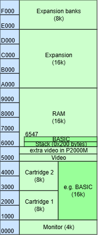

# P2000T

I got a Philips P2000T, and started to investigate it a bit.
This document describes my findings.
First getting to understand BASIC, later the BASIC cartridge.


## BASIC

I started with the cartridge "Basic Interpreter 16K" or "P2305" (for slot "1").
Trying a 10-print program works as expected. Still I had some issues.

- The cartridge has two character _modes_, lets call them mix and allcaps.
  This mode is not to be confused with the capslock state. 
  
  In the _mix_ mode, this is the behavior of shift and capslock.
  
  | key  | no shift, no capslock | shift, no capslock | no shift, capslock | shift, capslock |
  |:----:|:---------------------:|:------------------:|:------------------:|:---------------:|
  | [A]  |        **a**          |         A          |         A          |         A       |
  | [1!] |          1            |         !          |         !          |         !       |

  In the _allcaps_ mode, this is the behavior of shift and capslock.
  
  | key  | no shift, no capslock | shift, no capslock | no shift, capslock | shift, capslock |
  |:----:|:---------------------:|:------------------:|:------------------:|:---------------:|
  | [A]  |        **A**          |         A          |         A          |         A       |
  | [1!] |          1            |         !          |         !          |         !       |
  
  To engage capslock press the _Capslock_ key, to disengage capslock press the Shift key.
  To toggle the character mode press _Shift and Tab_.
  
  
  
  BASIC itself is not case sensitive, so `print` and `PRINT` are the same, and so
  are `a$` and `A$`. What is more, BASIC converts these to uppercase when you type 
  the lowercase (in program text).
  
  However, as I discovered, some programs ask `Are you sure [y/n]?` and 
  they do not accept (uppercase) `Y`.
  
  BASIC 1.1 NL starts in mix mode, but the BASIC 1.0 UK starts in allcaps mode.

- To edit a basic program, say line 30, you can not just type `LIST`, cursor to 
  line 30 and start correcting. You have to give the command `EDIT 30`, and then 
  you are in a sort of [VI editor](https://en.wikipedia.org/wiki/Vi_(text_editor)) 
  (that only helps if you did a bit of Linux).
  This editor has three states: command, insert, overwrite.
  
  By default, you are in the command state where pressing a key gives a command.
  - `C` ("change") switches to overwrite state; each character typed next 
    overwrites the old text. `CODE` switches back to command state.
  - `I` ("insert") switches to insert state; each character typed next is inserted before 
    the old text. `CODE` switches back to command state.
  - `X` ("append") moves to end of line and switches to insert.
  - `H` deletes to end of line and switches to insert.
  - `S` ("search") moves the cursor to the next character typed. Use Shift `Cursor right` for find next.
  - `K` ("kill search") deletes to the next character typed.
  - `ENTER` commits changes.
  - `STOP` (Shift `,` on numeric keypad) aborts all changes.
  - `Backspace` backspaces one character and Shift `Backspace` deletes one character.
  - Tip: also the _line number_ can be edited (then, the old line stays as is).
  
  In all modes, the cursor keys are operational.
  
  This overview is for BASIC 1.1; BASIC 1.0 UK is severely limited: e.g. 
  the cursor keys don't work and and `C` is for one character only.

- The tape recorder works as a disk drive. You can get a directory with Zoek
  (Shift `1` on numeric keyboard), and load and save is with commands `CLOAD` 
  and `CSAVE` to tape blocks.
  
  

  The directory listing only shows the first character of every file in 
  BASIC 1.0 UK, the screenshot is for BASIC 1.1 NL.

- The P2000T has a printer port at the back. 

  
  
  The great thing is that this is actually a _serial_ port.
  To connect it to a PC, you need an old style D25 connector/converter, and 
  a cable to convert from Serial to USB. I used a 
  [US232R-500-BULK](https://nl.mouser.com/ProductDetail/FTDI/US232R-500-BULK).
  
  In the PC start a terminal, e.g. [ninjaterm](https://ninjaterm-app.mbedded.ninja/), 
  connect to the correct COM port with settings 1200,8,N,1, and 
  try `LPRINT` to print a line, `LLIST` to list the program on the printer,
  or use print-screen (Shift `00` on numeric keyboard) to copy the current 
  screen to the printer.
  
  Here an example on an empty screen.
  I first did a `list`, then a `run` (which prints due to the
  `LPRINT` statements), then a `llist` (which prints the listing), and finally 
  I pressed print screen.
  
  
  
  The print screen button does not seem to work in BASIC 1.0 UK.
  
  > The `LLIST` and print screen are low threshold features to get 
  > data from P2000T to PC.
  
- What really confused me in the beginning was that my P2000T did not do what the 
  manual [Gebruiksaanwijzing](docs/Gebruiksaanwijzing-P2000T-met-P2305-BASIC-NL.pdf) specified
  (copy of [other repo](https://github.com/p2000t/documentation/blob/main/programming/Gebruiksaanwijzing%20P2000T%20met%20P2305%20Basic%20NL.pdf)).
  Later I found out the manual is for version NL 1.1, and my cartridge is UK 1.0.
  
  Differences I found
  - Version 1.1 adds many control chars. For example see that control 
    character 18 is not working in 1.0.
  
    
    
  - Several keyboard keys are not working: cursor (!), print screen (numeric Shift 5), 
    clear screen (numeric Shift upper right), Def for edit last (numeric  Shift 0).
    
    I did have a "Tekstbewerking" or "P2301" (for slot "1") cartridge, and there 
    the cursor keys did work, so I did know it was not a hardware fault.
    
  - Tape directory (Zoek numeric Shift 1) only shows first char of file name, 
    instead of full name, file type and file size.
    
  - Statement `inp("")` to get a single keyboard key does not work in 1.0.
  
  - Default character  mode is allcaps in 1.0. I did not know I could switch 
    to mixed (see above), but my program required that.


## Cartridge

Since I have BASIC UK 1.0, I borrowed the better NL 1.1 and started to investigate.

The cartridge is mapped to 0x1000-0x5000, as shown in the P2000T memory map below 
(see also the [FieldSupportManual](https://github.com/p2000t/documentation/blob/main/hardware/FieldSupportManual-2.pdf) at the bottom of page 3-3,
or the [Reference manual](https://github.com/p2000t/documentation/blob/main/hardware/P2000%20System%20T%20%26%20M%20Reference%20Manual.pdf) at page 4/4).



As the [Reference manual](https://github.com/p2000t/documentation/blob/main/hardware/P2000%20System%20T%20%26%20M%20Reference%20Manual.pdf)
explains, the monitor is the basic software for primitive functions such as
start-up, interrupt handling, and some input and output.

Above the monitor we find a 16k gap where a cartridge could slot in. Next is 
two pages (a 40×25) of video memory, the P2000M even has double the amount.

The standard P2000T comes with 16k byte RAM, a gap for another 16k and 
a gap for several 8k banks.

Here is a photo of the P 2305 Basic Interpreter 16K (UK 1.0).


Notice that the cartridge has
- One HN462732, a 4096-word x 8-bit UV erasable and programmable read only memory by Hitachi Semiconductor
- Three SBB2632, a 32768 bit MOS N-channel static ROM, organized as 4096 8-bit words by Mullard (acquired by Philips).
- Two 74LS367, a hex tri-state buffers.
- One 74LS138, a 3-Line To 8-Line Decoders/Demultiplexers.


The Monitor program in the first 4k checks the start of cartridge memory if 
there is a valid cartridge to jump to. It inspects its header, see 
[Reference manual](https://github.com/p2000t/documentation/blob/main/hardware/P2000%20System%20T%20%26%20M%20Reference%20Manual.pdf)
page 4/14.


I wrote this program to check the cartridge header of BASIC NL 1.1.

```basic 
110 DEFFNH2$(X)=RIGHT$("0"+HEX$(X),2)
120 DEFFNH4$(X)=RIGHT$("000"+HEX$(X),4)
125 A=&H1000:S=PEEK(A)
130 PRINT FNH4$(A);" sig   ";FNH2$(S)
140 A=A+1:N=PEEK(A)+256*PEEK(A+1)
145 PRINT FNH4$(A);" count ";FNH4$(N)
150 A=A+2:C=PEEK(A)+256*PEEK(A+1)
155 PRINT FNH4$(A);" insum ";FNH4$(C)
170 A=A+2:FOR I=0TO7:I$=I$+CHR$(PEEK(A+I)):NEXT I:PRINT FNH4$(A);" cname ";I$
180 R=PEEK(A+8)
185 PRINT FNH4$(A+8);" rev   ";FNH2$(R)
190 X=PEEK(A+9)+256*PEEK(A+10)
195 PRINT FNH4$(A+9);" resvd ";FNH4$(X)
197 PRINT FNH4$(A)"-"FNH4$(A+N-1);"  ";
200 REM Compute checksum over N bytes
210 IFN>0THENC=C+PEEK(A):A=A+1:N=N-1:GOTO210
220 IF C>65535 THEN C=C-65536:GOTO 220
300 PRINT "CSUM ";FNH4$(C);" ";
310 IF C=0 THENPRINT"ok" ELSEPRINT"err"
```

This was the output

```text
1000 sig   5E
1001 count 0FFB
1003 insum 8000
1005 cname RobRob83
100D rev   02
100E resvd 0000 
1005-1FFF  CSUM 0000 ok
```

- The 5E signature on address 1000 looks ok.
- The count 0FFB on address 1001/1002 is strange.
  The checksum is computed from 1005 onward, 1005+0FFB-1 is 1FFF, so this covers only the first 4k of the BASIC rom.
  Maybe the checksum only checks the EPROM part of the cartridge.
- The checksum is a bit tricky, what is listed here is the initial value of the checksum.
  All bytes from 1005 to 1FFF are added to that, and then the remaining value should be 0000.
  I'm surprised that the initial value is such a neat number (8000).
- At 1005 we find the cartridge name `RobRob83`. It is never (?) shown to the user.
  This seems to be the authors' signature.
- Apparently revision 2.


My BASIC program computes the checksum as Ivo 
[explains](https://philips-p2000t.nl/cartridges/simple-cartridge.html#cartridge-validation) it ,
and indeed, the resulting value is 0.

```asm
; validate cartridge ROM 
; inputs:
; HL points to 1st byte of cartridge ROM to check
; 1st 5 bytes of cartridge ROM:
; defb signature
; defw len
; defw checksum
; returns: Z flag if success
; jumps into cassette bootstrap routine on error

validate_cartridge:
    inc hl                      ; skip signature byte
    ld c,(hl)                   ; lo byte of byte count
    inc hl                      ;
    ld b,(hl)                   ; hi byte of byte count
    inc hl                      ;
    ld e,(hl)                   ; lo byte of checksum
    inc hl                      ;
    ld d,(hl)                   ; hi byte of checksum

rom_test_loop:  
    ld a,b                      ; is byte count zero? 
    or c                        ; 
    jr nz,do_ROM_test           ; no, so keep checking 
    ld a,d                      ; all bytes were added to DE, checksum shall now be zero
    ret z                       ; Z is ok, NZ = checksum error
    jp bootstrap                ; try to load a program from tape

do_ROM_test:    
    inc hl                      ;get next byte
    ld a,(hl)   
    add a,e                     ;add to 16 bit checksum 
    jr nc,no_add_carry  
    inc d                       ;handle carry 
no_add_carry:   
    ld e,a                      ;sum back in e
    dec bc                      ;dec bytes done 
    jr rom_test_loop
```


Since My BASIC NL 1.1 is a borrowed cartridge, I decide to make a dump of it, 
to the printer (using `LPRINT`).

```basic 
110 DEFFNH2$(X)=RIGHT$("0"+HEX$(X),2)
120 DEFFNH4$(X)=RIGHT$("000"+HEX$(X),4)
130 FOR A=&H1000 TO A+16*1024-1 STEP 8
140 LPRINT FNH4$(A);" ";:H$=""
150 FOR I=A TO A+7:D=PEEK(I)
160 LPRINT " ";FNH2$(D);
165 IF D<32 OR D>127 THEN D=46
168 H$=H$+CHR$(D)
170 NEXT I
180 LPRINT"  ";H$
190 NEXT A
```

I connected my P2000T with a serial to USB cable to my PC, and recorded the 
printing. Here is the first couple of lines

```text
1000  5E FB 0F 00 80 52 6F 62  ^....Rob
1008  52 6F 62 38 33 02 00 00  Rob83...
1010  C3 66 1F C3 E6 60 C3 C4  .f...`..
1018  1F 1C 86 8D 50 48 49 4C  ....PHIL
1020  49 50 53 20 43 41 53 53  IPS CASS
1028  45 54 54 45 20 42 41 53  ETTE BAS
1030  49 43 04 03 02 83 56 65  IC....Ve
1038  72 73 69 65 20 31 2E 31  rsie 1.1
1040  86 4E 4C 04 05 02 86 00  .NL.....
1048  C9 00 C3 C0 60 C3 3A 19  ....`.:.
1050  C3 D0 60 C3 48 15 C3 5A  ..`.H..Z
1058  1F C3 4F 17 C3 E2 16 C3  ..O.....
1060  C3 60 C3 18 19 C3 53 1D  .`....S.
1068  C9 00 00 C9 00 00 C3 63  .......c
```

You find the complete result in the repo [basic1.1.log](cartridgedump/basic1.1.log).
You will find some empty lines, my assumption is that the P2000 
adds 6 empty lines every 66 lines, to skip the performation of the 
continuous paper of the 1980's printers.

Finally, I write a [python script](cartridgedump) to convert that dump to pure binary.

```python
inname= "basic1.1.log"
outname= "basic1.1.bin"
bin =b""
print( f"Reading {inname}")
with open(inname, 'r') as file:
  for line in file:
    if len(line)!=40 : continue
    hexs = line[6:29].split(" ")
    bin+= bytes([int(x, 16) for x in hexs])

print( f"converted {len(bin)} bytes")

print( f"Writing {outname}")
with open(outname, 'wb') as file:
  file.write(bin)
```

The resulting binary is also in the repo [basic1.1.bin](cartridgedump/basic1.1.bin).
I downloaded a [binary](https://github.com/p2000t/software/blob/main/cartridges/BASICNL1.1.bin) 
from the P2000 preservation project , and they are identical.
My ripper works.


## Links

- [Preservation project](https://github.com/p2000t), especially 
  - [Nieuwsbrief Natlab](https://github.com/p2000t/documentation/tree/main/NatLab)
  - [Software](https://github.com/p2000t/software)
- [Retroforum](https://www.retroforum.nl/topic/3914-philips-p2000t)
- [Retrospace](https://retrospace.nl/Philips_P2000T_homecomputer.html)

(end)
